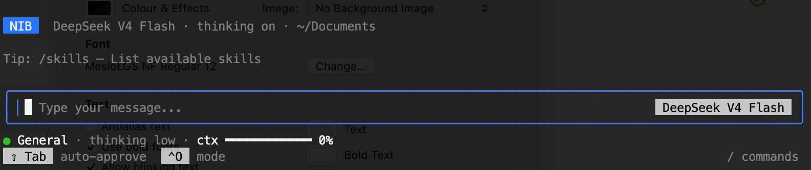

# Nib

[](https://github.com/amenski/nib/actions/workflows/build.yml)
[](./LICENSE)
[](https://nodejs.org)

A terminal coding agent you can inspect, configure, and own. Nib combines a
multi-provider agent loop with explicit permissions, resumable sessions,
checkpoints, skills, and MCP — without a hosted service or telemetry.

<p align="center">
  
</p>

## Quick start

Requires Node.js 20+ and Git. Nib is currently installed from source:

```bash
git clone https://github.com/amenski/nib.git
cd nib
npm install
npm run build && npm link
```

Add a provider key, then check the installation:

```bash
nib auth                         # stores keys in ~/.nib/credentials.yaml
nib doctor                       # shows config and credential sources
```

You can use an environment variable instead, such as `DEEPSEEK_API_KEY` or
`OPENAI_API_KEY`.

Start a session:

```bash
nib                              # interactive
nib "explain src/foo.ts"         # start with a prompt
nib -c                           # continue the most recent session
nib -p "..."                     # one-shot, no TUI (for scripts)
```

> Upgrading from Heirloom? Nib intentionally does not read `~/.heirloom`.
> Run `nib auth` again or copy `credentials.yaml` into `~/.nib` with mode
> `0600`. See the [v0.5.0 migration notes](./CHANGELOG.md#050--2026-09-15)
> before moving sessions, settings, or trust stores; do not symlink the two
> state directories.

## How Nib works

```
nib [general] > explain this codebase            read-only by default
nib [general] > /mode code                       enable implementation tools
nib [code]    > Shift+Tab                        cycle normal / auto-approve / plan
```

New sessions start in `General`, a fast, read-only mode. Switch to `Code` when
you want Nib to edit files, run commands, or delegate work. Independently,
`Shift+Tab` cycles the permission posture through `normal → auto-approve →
plan`. The active mode controls which tools exist; the posture controls how
Nib may use them.

### Two personas

A persona changes three things together: the role at the top of the system
prompt, the tool groups offered to the model, and—when configured—the files it
may edit. These are hard runtime boundaries, not requests for the model to
behave differently.

| Persona | Capabilities | Best used for |
|---|---|---|
| **General** *(default)* | Read-only; DeepSeek V4 Flash at low effort | Questions, exploration, and everyday conversation |
| **Code** | Read, edit, shell commands, background jobs, and sub-agent delegation | Building, fixing, refactoring, and verification |

Nib deliberately keeps the current built-in surface to General and Code. Code
handles planning, architecture, debugging, implementation, and delegation
without making you choose a different persona for each phase. Project and
global YAML files can still define custom personas with their own role, tool
groups, file restrictions, model, and reasoning effort. Select a custom
persona explicitly by slug with `--mode` or `/mode`; the picker lists the two
current built-ins. See the [mode specification](./docs/mode-spec.md).

| Keys / commands | |
|---|---|
| `Enter` | send · `Shift+Enter` newline |
| `Esc` | interrupt; keep complete exchanges, discard partial streamed text |
| `Shift+Tab` | cycle the approval posture |
| `/` | open the command menu |
| `/help` | full command list |
| `/model`, `/effort` | pick model · set reasoning effort |
| `/new`, `/resume`, `/continue` | session management |
| `/undo` | rewind code and/or conversation |
| `/theme` | switch color theme (live preview) |
| `/permissions` | this session's permission history |
| `/skills`, `/mcp`, `/tasks` | list skills · inspect MCP servers · inspect/stop sub-agent tasks |
| `Ctrl+D` twice | quit |

### Common CLI flags

| Flag | Meaning |
|---|---|
| `[prompt]` | positional prompt to submit on launch |
| `-p, --print` | print the response and exit, non-interactive (needs a prompt) |
| `-r, --resume [id]` | resume a session by ID, or open the picker |
| `-c, --continue` | continue the most recent session for this directory |
| `--model <provider/model>` | override the configured model |
| `--mode <name>` | start in a given mode |
| `--add-dir <path>` | add a trusted writable directory (repeatable) |
| `--max-turns <n>` | cap agentic turns in print mode |
| `-d, --debug` | opt in to diagnostic request/response JSONL (includes conversation and tool payloads, with secret redaction) |

```bash
cat error.log | nib -p "Explain this error"
```

Run `nib --help` for the complete command-line reference.

---

## Configuration

Create `~/.nib/settings.json` (or `./.nib/settings.json` per project;
project wins when both exist):

```jsonc
{
  "permissions": {
    "defaultMode": "askAll",
    "rules": [
      { "tool": "read_file",     "pattern": "./**", "action": "allow" },
      { "tool": "write_to_file", "pattern": "./**", "action": "allow" },
      { "tool": "run_bash",      "pattern": "*",    "action": "ask"   }
    ]
  },
  "mcpServers": {
    "filesystem": { "command": "npx", "args": ["-y", "@modelcontextprotocol/server-filesystem", "."] }
  }
}
```

With the default DeepSeek setup, General uses DeepSeek Flash with low
reasoning effort to keep everyday chat fast and inexpensive. An explicit
provider or model selection in settings, flags, or slash commands takes
precedence; use `model` and `provider` here, `--model`, or `/model` to choose.

- Store API keys in `~/.nib/credentials.yaml` (via `nib auth`) or env
  vars — not in settings.json.
- Project instructions: `.nib/instructions.md` (or `AGENTS.md`).
- Custom modes: drop a YAML file into `~/.nib/modes/`.

Full schema: [`docs/config-spec.md`](./docs/config-spec.md).

---

## Features

- **Modes with real tool boundaries.** `general` is read-only; `code` adds
  editing, commands, debugging, and delegation. Custom modes can define their
  own instructions and tool groups.
- **Explicit permissions.** Allow, ask, or deny by tool and pattern. Every
  decision is inspectable through `/permissions`.
- **Recoverable edits.** Interactive edits are checkpointed in a shadow Git
  repo; `/undo` can rewind code, conversation, or both.
- **Durable sessions.** Conversations are append-only JSONL with automatic
  compaction and resumable todo state. Continue by directory or resume by ID.
- **Skills, MCP, and sub-agents.** Load [Agent Skills](https://agentskills.io),
  connect stdio MCP servers, and delegate bounded work through `new_task`.
- **Safe file coordination.** Nib tracks when it last read a file and refuses
  to overwrite changes made outside the agent.
- **Optional web access.** Keyless Bing RSS search and HTTPS fetch are
  permission-gated and marked as untrusted input; arbitrary fetch targets are
  also SSRF-checked. A local SearXNG instance can provide richer results.
- **Terminal-native visibility.** Streaming output, live themes, token/cost
  reporting, diagnostics, task status, and opt-in redacted debug logs are all
  available without leaving the TUI.

## Inside the core

Nib's core agent runtime is intentionally one inspectable process. Neither the
TUI nor the headless CLI hides a remote agent service. Providers receive tool
schemas, but never direct access to tool execution or local files:

```text
TUI / headless CLI → prompt assembly → agent loop ↔ model provider
                                           │
                                           ├─ permission engine → tool registry → files, shell, MCP, sub-agents
                                           │                         │
                                           │                         └─ edit checkpoints (interactive)
                                           │
                                           └─ session log → context editing and compaction
```

| Core | Responsibility |
|---|---|
| [**Provider boundary**](./docs/provider-spec.md) | Adapts each model through one canonical message and streaming contract. |
| [**Agent loop**](./docs/subsystems/react-loop.md) | Streams replies, batches tool calls, reflects on failures, guards loops, and stops deterministically. |
| [**Prompt assembly**](./docs/system-prompt.md) | Combines a stable cacheable preamble with live project state, rules, research, skills, and todo context. |
| [**Personas**](./docs/mode-spec.md) | Change identity and remove unavailable tool groups before a request reaches the model. |
| [**Permission engine**](./docs/permission-spec.md) | Resolves allow/ask/deny rules before execution and records every decision. |
| [**Tool registry**](./docs/tool-spec.md) | Keeps tool schemas, mode groups, and handlers behind one dispatch boundary. |
| [**Sessions and context**](./docs/subsystems/context-management.md) | Preserve the complete append-only transcript while compacting or editing only provider-bound context. |
| [**Checkpoints**](./docs/session-spec.md) | Snapshot edits in per-session shadow Git repositories so code and conversation can rewind together. |
| [**TUI**](./docs/cli-spec.md) | Presents streaming output, approvals, plans, jobs, tasks, models, sessions, and diagnostics. |

Start with the [architecture overview](./docs/architecture.md), then follow the
[core-system reading path](./docs/README.md#reading-paths) into the normative
specs and subsystem deep dives.

## Supported models

Nib ships provider presets for DeepSeek, OpenAI, OpenRouter, Groq, and local
Ollama. The bundled catalog supplies the selectable models for each provider;
switch with `/model` or `--model <provider/model>`. DeepSeek V4 Pro is the
primary tested model, while the default `general` mode uses DeepSeek V4 Flash
at low reasoning effort.

---

## Better search (optional)

`web_search` works out of the box via keyless Bing RSS — thin, snippet-only
results. For richer results (and inline content excerpts), run your own
[SearXNG](https://docs.searxng.org/) instance locally and point nib at it:

```bash
# 1. Start it (localhost-only, port 8888). The compose file renders a fresh
#    random secret_key container-side on every start — the shipped
#    searxng/settings.yml stays a read-only template.
docker compose up -d

# 2. Verify
curl -s http://localhost:8888/healthz    # → OK
curl -s "http://localhost:8888/search?q=test&format=json" | head -c 120
```

Then add one line to `~/.nib/settings.json`:

```json
"webSearch": { "searxngUrl": "http://localhost:8888" }
```

SearXNG becomes the primary backend, Bing stays as the automatic fallback
when the instance is down, and the top results come back with inline
content excerpts (`enrich` defaults on). `http://` is accepted only for
localhost; a remote instance must use `https://`. See
[`docs/web-search-spec.md`](./docs/web-search-spec.md).

> If you already run a SearXNG container named `searxng` on port 8888,
> remove it (`docker rm -f searxng`) before `docker compose up` — the
> compose file manages the same name and port.

## FAQ

### Why another AI coding agent?

Nib started as a fix for an agent that broke inside IntelliJ's embedded
terminal. It grew into a full tool by combining the best ideas from opencode,
RooCode, Aider, and SWE-agent — modes, checkpoints, permission rules — with
zero telemetry and no vendor lock-in. Every design decision is documented in
[`docs/`](./docs/).

### Does it send my data anywhere?

Nib has no telemetry or analytics. It sends prompts and tool results to
the model provider you select, and may contact integrations you explicitly
configure or invoke, such as web search, MCP servers, hooks, or notifications.

### Is it safe to use on production code?

Nib executes model-chosen commands on your machine. The permission system
is the safety net — read [`docs/security-spec.md`](./docs/security-spec.md)
before enabling auto-approve on code you didn't write.

### How do I configure MCP?

Add `mcpServers` to settings.json (see Configuration above), then use `/mcp` to
inspect connected servers. See [`docs/config-spec.md`](./docs/config-spec.md).

### How do I get notified when a task completes?

Set `notify` in settings.json to the path of a notification script.
See [`docs/notify-spec.md`](./docs/notify-spec.md).

### Does it support images?

Yes — three routes:

- **Paste** — `Ctrl+V` attaches an image from the clipboard.
- **Mention** — `@path/to/shot.png` in the prompt attaches that file
  (permission-gated like `read_file`).
- **Tool** — the model calls `view_image` for an https image URL or a local
  file path.

Images must be PNG, JPEG, GIF, or WebP and at most 5 MB. The active model
must accept image input. `read_file` refuses binary files rather than
returning garbled text.

### Does it support Thinking mode?

Yes. Thinking is enabled by default; set `thinkingEnabled: false` in
settings.json to disable it. Models with effort metadata support reasoning
effort control through `/effort`.

---

## Docs

**Start at [`docs/README.md`](./docs/README.md)** — the canonical index of
specs, deep dives, and troubleshooting, with reading paths for new
contributors, maintainers, and users. [`docs/archive/`](./docs/archive/)
holds superseded designs and completed task briefs (records, not reference).

Having trouble? See [`docs/troubleshooting.md`](./docs/troubleshooting.md).

---

## Contributing

```bash
git clone https://github.com/amenski/nib.git
cd nib
npm install
npm test              # run the test suite
npx tsc --noEmit      # type gate
npm run build         # bundle with tsup
```

See **[CONTRIBUTING.md](./CONTRIBUTING.md)** for the PR checklist, code map,
and good first contributions. [Code of Conduct](./CODE_OF_CONDUCT.md) applies.

---

## License

[Apache 2.0](./LICENSE)
