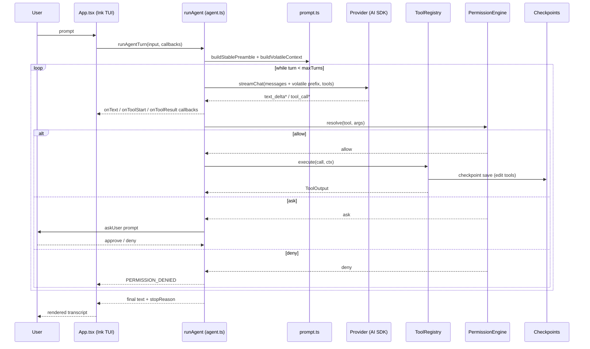

# Architecture

**Status:** current · verified 2026-08-13 · covers the whole `src/` tree; deep dives in [subsystems.md](./subsystems.md)

> Personal AI coding agent. Provider-agnostic, mode-gated, safety-first.
> Target: opencode-quality CLI, built incrementally from first principles.

## 1. Philosophy

Build an agent that **you fully understand**. Every line has a known
purpose. The name "nib" means something you build once and keep — the
architecture reflects that: each layer is independently understandable,
replaceable, and testable. No layer depends on implementation details of
another.

## 2. The 7 layers

Inspired by how opencode, RooCode, Aider, and SWE-agent decompose the
problem:

```
┌─────────────────────────────────────────────────────────────┐
│  Layer 7: CLI + TUI (Ink/React — shipped)                   │
│  What the user sees. Commands, prompts, streaming output.   │
├─────────────────────────────────────────────────────────────┤
│  Layer 6: Modes (personas with tool gates + file restrictions)
│  YAML-defined personas: General and Code, plus hidden        │
│  compatibility aliases for retired modes.                   │
├─────────────────────────────────────────────────────────────┤
│  Layer 5: Safety (permissions + checkpoint/restore)          │
│  Pattern-based allow/ask/deny rules + shadow-Git checkpoints.│
├─────────────────────────────────────────────────────────────┤
│  Layer 4: Context (compaction + RepoMap + token budget)      │
│  Auto-compaction with overflow detection; symbol map.        │
├─────────────────────────────────────────────────────────────┤
│  Layer 3: Agent Loop (enhanced ReAct engine)                 │
│  ReAct: Thought → Action → Observation, plus self-reflection │
│  and layered error recovery.                                 │
├─────────────────────────────────────────────────────────────┤
│  Layer 2: Tools (registry + 6 edit strategies + bash + fs)   │
│  Tools are designed for LLM consumption, not human use.      │
├─────────────────────────────────────────────────────────────┤
│  Layer 1: Providers (AI SDK v7 behind one contract)          │
│  Canonical types boundary the loop; the SDK handles wires.   │
└─────────────────────────────────────────────────────────────┘
```

## 3. Layer 1 — Providers

The agent loop speaks only canonical types (`src/types.ts`); wire formats
are the Vercel AI SDK's job (`src/providers/aisdk.ts` maps `streamText`
events to the canonical `StreamEvent` union). Presets, the model catalog,
and key resolution live in `src/providers/{presets,catalog,registry}.ts`.
Full contract: provider-spec.md.

The historical adapter files (`deepseek.ts`, `openai-compatible.ts`,
`anthropic.ts`) were deleted in the 2026-07-29 AI SDK migration
(docs/archive/migration-aisdk-ink.md).

## 4. Layer 2 — Tools

**Why 6 edit tools instead of 1?** RooCode's key insight: with one generic
"edit" tool the LLM has to derive the right strategy from the description;
with 6 specialized tools, the system prompt guides it to pick the right one.
More prompt tokens = fewer wrong tool calls.

| Tool | Strategy | Inspired by |
|------|----------|-------------|
| `edit` | Exact string → replacement | opencode |
| `edit_file` | Replace-all with count validation | RooCode |
| `search_replace` | Global find-and-replace | RooCode |
| `apply_diff` | Unified diff, first occurrence | RooCode, Aider's editblock |
| `apply_patch` | Multi-file unified diff | RooCode |
| `write_to_file` | Full file overwrite | RooCode, opencode |

**ToolRegistry** centralizes tool metadata (mode groups, defs);
**ToolContext** carries session-scoped state (workingDir, sessionId,
askUser/askQuestion, signal, checkpoint, fileMtimes, todoStore) so tools
need more than the LLM's arguments. Full inventory: tool-spec.md.

## 5. Layer 3 — Agent loop

**Why ReAct?** Interleaving reasoning (text output) with acting (tool
calls) beats either alone (Yao et al., 2022); every major coding agent uses
this pattern. Enhancements over vanilla ReAct:

1. **Streaming** — text streams to the user in real time; tool calls
   accumulate and execute as a batch (parallel fast path for multi-read
   turns, `src/agent.ts`).
2. **Self-reflection** (Aider) — a failed tool result feeds back to the LLM
   before the user sees it; one chance to self-correct
   (`src/selfreflection/`).
3. **Layered error recovery** (SWE-agent) — parse error → correction
   prompt; tool error → reflection; fatal → preserved-state system message
   (`src/errorrecovery/`).
4. **Auto-compaction** (opencode) — old messages summarized before the
   next call when the budget trips (subsystems.md §2).
5. **Loop guards** — 3 identical failures warn, 4 trip loop detection, 5
   consecutive failures end the turn; `maxTurns` default 100.

### One turn, end to end

```
user message
   │
   ▼
buildStablePreamble (cached, byte-stable, messages[0])
   │
   ▼
buildVolatileContext (plan-mode + research, env) ──► prepended to trailing user msg
   │   + live todo block (re-read per sub-turn)
   ▼
provider.streamChat (AI SDK) ──► text_delta* streamed to UI
   │
   ▼
tool calls ──► registry.execute ──► PermissionEngine (most-restrictive-wins, audited)
   │              │  allow ──► handler (ToolOutput, never throws)
   │              │  ask   ──► askUser prompt (posture-aware)
   │              └─ deny  ──► PERMISSION_DENIED
   ▼
observations appended ──► diagnostics check ──► compaction check (0.7 × window)
   ▼
stop: done | aborted | max_turns
```

### Sequence (Mermaid)



## 6. Layer 4 — Context management

RepoMap gives the LLM a compressed, semantically rich view of the codebase
(session-stable snapshot, 4 KB cap); compaction summarizes old messages
when the window fills so conversations can run arbitrarily long. Token
budget uses a chars/4 heuristic (`src/compaction/budget.ts`). Deep dive:
subsystems.md §2 and §4.

## 7. Layer 5 — Safety

Pattern-based permissions (evaluated most-restrictive-wins, fail-closed on
unresolved) plus per-session shadow-Git checkpoints that rewind files *and*
conversation state. Deep dives: permission-spec.md, security-spec.md,
checkpoint details in session-spec.md.

## 8. Layer 6 — Modes

A mode is a YAML persona gating tool groups and file writes. **General** is the
read-only default, while **Code** has implementation access plus the workflow
group for `new_task` delegation. Ask, Architect, Debug, and Orchestrator remain
hidden aliases for compatibility with older sessions and explicit slugs. This
prevents "oops, I accidentally edited your production config" at the
architectural level. Details: mode-spec.md.

## 9. Layer 7 — CLI & TUI

Ink/React TUI (`src/ui/App.tsx`), rendered with `incrementalRendering`.
Layout: transcript (`OutputArea`) → todo panel → modal overlays → queued
follow-ups → `PromptInput` + status bar → `HintBar` (deliberately the last
row — see the repaint note in `src/ui/HintBar.tsx`). Full command surface:
cli-spec.md.

## 10. Where files live

| Scope | Location |
|-------|----------|
| Global config | `~/.nib/settings.json` (or `$NIB_HOME/settings.json` — partial support, see config-spec.md §15) |
| Global credentials | `~/.nib/credentials.yaml` (0600) |
| Global modes | `~/.nib/modes/<slug>.yaml` |
| Project config | `./.nib/settings.json` |
| Project modes | `./.nib/modes/<slug>.yaml` |
| Project instructions | `./.nib/instructions.md` (or `AGENTS.md`) |
| Project rules | `./.nib/rules/**/*.md` |
| Project research | `./.nib/research/**/*.md` |
| Project skills | `./.nib/skills/`, `./.agents/skills/` |
| Sessions | `~/.nib/sessions/<slug>/<id>.jsonl` |
| Checkpoints | `~/.nib/checkpoints/<sessionId>/` (shadow git repo) |
| Memory | `~/.nib/memory/<slug>/` + global `MEMORY.md` |

## 11. File manifest

```
src/
├── cli.tsx                     # Entry: main(), subcommand dispatch, slash routing
├── cli-args.ts                 # yargs: flags, validation, epilog
├── exec-runner.ts              # Headless -p mode (runExecMode)
├── agent.ts                    # Layer 3: runAgent loop, permission gating
├── prompt.ts                   # buildStablePreamble / buildVolatileContext / rules / repo map
├── types.ts                    # Canonical types: Message, ToolDef, ToolCall, ToolOutput
│
├── providers/
│   ├── types.ts                # Provider interface, StreamEvent, ModelCapabilities
│   ├── presets.ts              # BUILTIN_PRESETS, createProvider, key resolution
│   ├── aisdk.ts                # AI SDK v7 streamText → StreamEvent mapping
│   ├── catalog.ts              # ~/.nib/models.json merge
│   ├── registry.ts             # capability lookup
│   ├── provider-presets.json   # bundled provider connection settings
│   └── models.json             # generated bundled model metadata snapshot
│
├── tools/
│   ├── types.ts                # ToolContext, ToolHandler, ToolGroup
│   ├── registry.ts             # ToolRegistry (register/getByMode/execute)
│   ├── files.ts                # read_file, list_files, glob
│   ├── edit.ts                 # 6 edit tools + stale-file detection
│   ├── bash.ts                 # run_bash (120s cap)
│   ├── jobs.ts                 # run_bash_background, check_job, kill_job
│   ├── search.ts               # search (grep)
│   ├── web-search.ts           # web_search (Bing RSS, keyless)
│   ├── web-fetch.ts            # web_fetch (Readability, SSRF guard)
│   ├── web-fetch-guard.ts      # hostname allow/deny
│   ├── ask_user_question.ts    # structured clarification
│   ├── todo.ts                 # update_todo_list + TodoStore
│   └── index.ts                # registration + module ToolContext
│
├── permissions/                # engine, rules, bash-normalize, destructive,
│                               # guarded, builtin-allow, diffpreview
├── checkpoints/                # shadow-Git checkpoint/restore
├── compaction/                 # budget.ts + compactor.ts
├── repomap/                    # symbol map (4KB budget)
├── sessions/                   # JSONL store, index, redaction
├── memory/                     # per-project memory store
├── skills/                     # SKILL.md loader + trust + load_skill
├── modes/
│   ├── loader.ts               # YAML mode loader + precedence
│   └── builtin/*.yaml          # general, code + hidden aliases
├── mcp/                        # client.ts + connector.ts (mcp__ tools)
├── orchestrator/               # new_task sub-agents
├── selfreflection/             # error reflection
├── errorrecovery/              # JSON-correction + fatal handling
├── diagnostics/                # post-edit checks + stall watchdog
├── auth/                       # nib auth wizard
├── notify.ts                   # notify hook
└── ui/                         # Ink TUI: App, core/, views/, components/,
                                # contexts, keybindings, theme, statusline
```

## 12. Key design tradeoffs

1. **Canonical types vs SDK types.** Canonical types make the agent loop
   provider-agnostic forever; the AI SDK now handles wire formats.
   Decision: canonical types at the loop boundary, SDK underneath.
2. **6 edit tools vs 1.** More tools = more prompt tokens, but higher-
   quality edits. Decision: 6 tools.
3. **Git-based checkpoints vs file snapshots.** Git is heavier but gives
   diff viewing, selective restore, and conversation-aware rollback for
   free. Decision: shadow Git repo.
4. **YAML modes vs code-defined modes.** YAML lets users define custom
   modes without TypeScript. Decision: YAML.
5. **readline vs Ink TUI.** Decided 2026-07-29: **Ink** (React for
   terminals) — shipped (`src/ui/`).
6. **Single process vs client/server.** opencode runs a local server; the
   TUI is a client. Decision: single process — nib is a personal
   agent, and the extra protocol layer buys nothing yet. Guardrail held:
   the agent loop does no I/O itself — output flows through callbacks, and
   headless printing lives in `src/exec-runner.ts` — so a server frontend
   remains a Layer 7 swap, not a rewrite.

## 13. Research foundation

| Paper / Source | Key idea | Applied to |
|----------------|----------|------------|
| ReAct (Yao 2022) | Thought → Action → Observation loop | Layer 3 |
| SWE-agent (Yang 2024) | Agent-Computer Interface, layered error recovery | Layers 2, 3 |
| opencode | Permissions, compaction, MCP | Layers 4, 5 |
| RooCode | Modes, 6-edit-tool, checkpoints, orchestrator | Layers 2, 5, 6, 8 |
| Aider | RepoMap, self-reflection, token budget | Layers 3, 4 |
